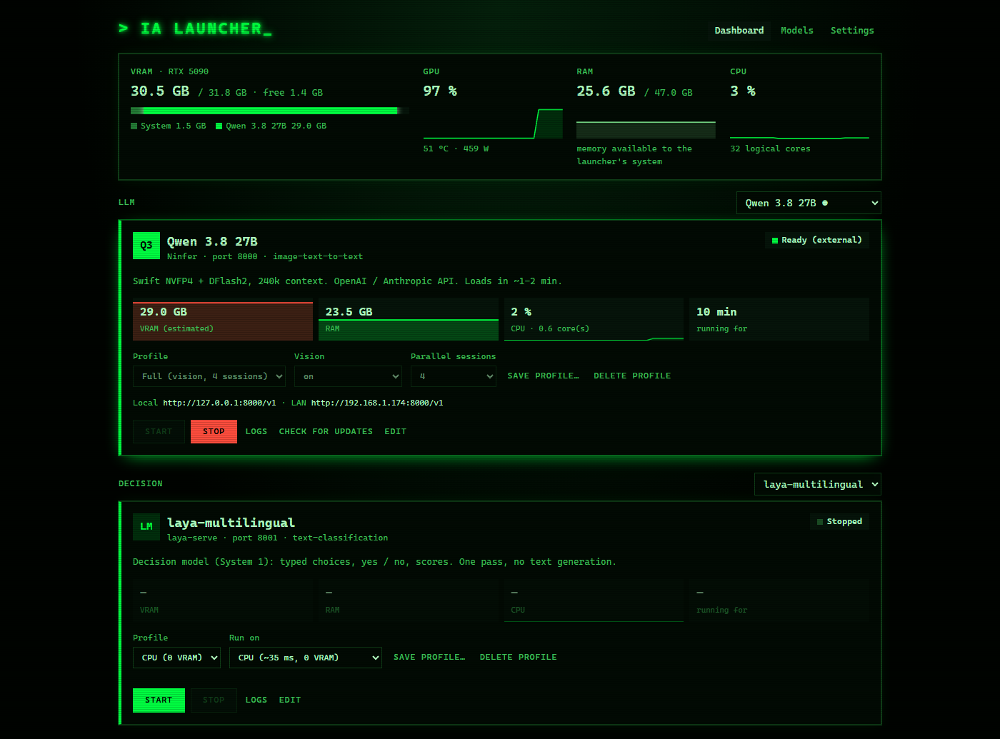
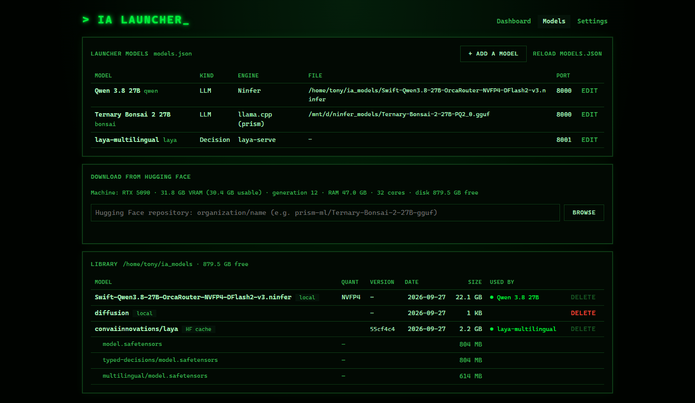
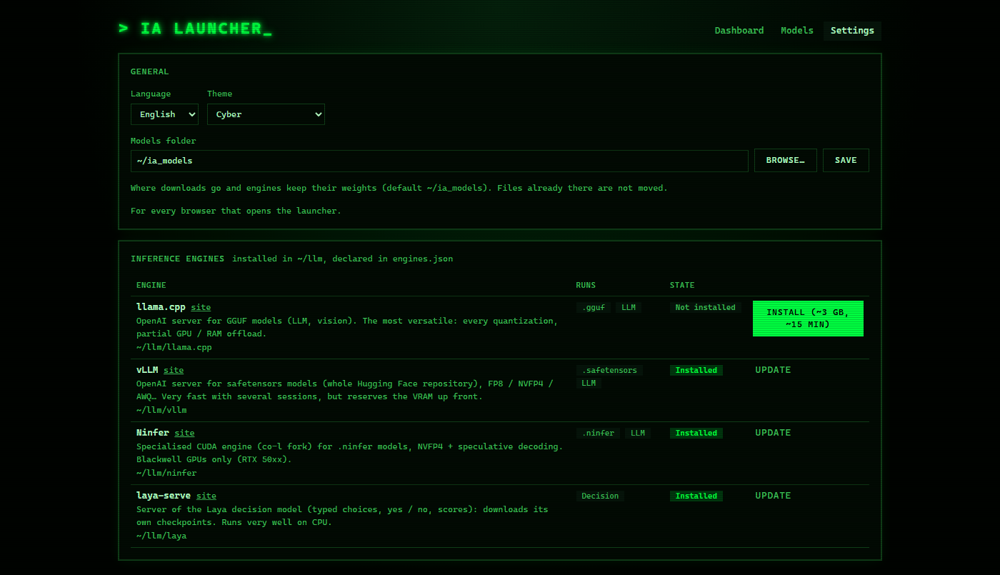

# IA Launcher

A local web page to start and stop AI models on your own machine, and see what they use: VRAM, RAM, CPU.
Think of a small, self-hosted LM Studio for Linux / WSL: models and inference engines are configuration,
nothing in the code is specific to one model or one engine.



## Features

- **Start / stop models** with profiles (context size, parallel sessions, vision, CPU or GPU…), from any
  browser on your LAN
- **Live usage**: VRAM per model (inferred, since `nvidia-smi` under WSL doesn't report per-process
  memory), RAM, CPU, GPU load and temperature
- **Hugging Face browser**: paste a repository and get a "does it run here?" verdict for every variant,
  based on your GPU, your installed engines and free disk, then download what fits
- **Engine catalog**: install llama.cpp, vLLM and others from the page when a model needs one, with no
  sudo (the CUDA toolkit comes from NVIDIA's pip wheels)
- **Library**: every model file of your models folder, which model uses it, and cleanup
- **Settings**: UI language (English, French), theme (auto, light, dark, cyber, pixel, neo), models folder
- Port conflict detection; the models the launcher started stop with it
- Under WSL, Windows doesn't go to sleep while a model is loaded

| Models | Settings |
|---|---|
|  |  |

## Requirements

- Linux or WSL2 (Ubuntu tested), with systemd for the optional boot service
- An NVIDIA GPU with its driver (`nvidia-smi`). The page still works without one, but most engines need it
- [uv](https://github.com/astral-sh/uv) (Python and the venvs) and [just](https://github.com/casey/just)
  (the commands below)
- To build engines from the catalog: `sudo apt install git cmake ninja-build build-essential`

## Getting started

```sh
git clone https://github.com/ikarys/ia_launcher.git
cd ia_launcher
just run              # http://localhost:8090, also reachable from the LAN
```

`run.sh` creates the launcher's venv on the first run and keeps it in sync with `requirements.txt`.
On first start there is no model and no engine yet:

1. **Settings → Inference engines**: install an engine (llama.cpp is the most versatile)
2. **Models → Download from Hugging Face**: paste a repository, pick a variant that fits, download it
3. **Library → Add as a model**, then start it from the **Dashboard**

To start the launcher when the machine (or WSL) boots:

```sh
just install-service  # systemd service; then: just logs-service, just restart
```

## Documentation

- [How-to guides](docs/how-to.md): install an engine, add a model, profiles, custom engines, languages…
- [Configuration](docs/configuration.md): `engines.json`, `models.json`, `settings.json`, environment variables
- [Architecture](docs/architecture.md): how the code is organised
- [Contributing](CONTRIBUTING.md)

## License

[MIT](LICENSE)
