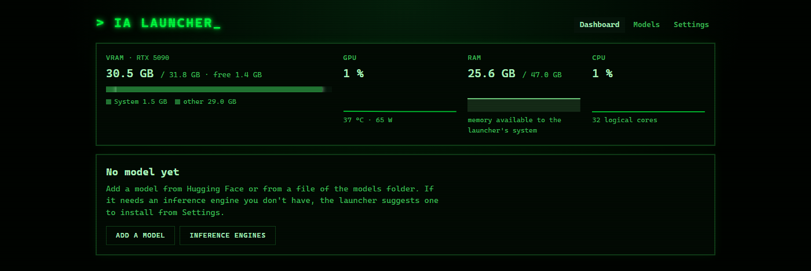

# How-to guides

- [Install an inference engine](#install-an-inference-engine)
- [Add a model from Hugging Face](#add-a-model-from-hugging-face)
- [Add a model file you already have](#add-a-model-file-you-already-have)
- [Save start settings as a profile](#save-start-settings-as-a-profile)
- [Use a model from another application](#use-a-model-from-another-application)
- [Add an engine that isn't in the catalog](#add-an-engine-that-isnt-in-the-catalog)
- [Move the models folder](#move-the-models-folder)
- [Start the launcher at boot](#start-the-launcher-at-boot)
- [Add a UI language](#add-a-ui-language)
- [Troubleshooting](#troubleshooting)

On the first start, the dashboard says where to begin:



## Install an inference engine

**Settings → Inference engines** lists the engines the launcher knows, what they run, and whether your
GPU can run them. **Install** runs the engine's script in the background (estimated size and time on the
button); its log shows in the page. Engines go to `~/llm/<engine>` and are added to `engines.json`.

No sudo is needed: engines are built against a CUDA toolkit made of NVIDIA's pip wheels. The system tools
for builds are the only prerequisite: `sudo apt install git cmake ninja-build build-essential`.

**Update** on an installed engine runs its script again (pull and rebuild).

## Add a model from Hugging Face

1. **Models → Download from Hugging Face**: type a repository, `organization/name`, then **Browse**.
2. Every variant (quantization) gets a verdict computed from your GPU, your installed engines and your free
   disk: runs on the GPU, needs a partial offload, doesn't fit, or needs an engine you don't have. In that
   last case the launcher suggests an engine from the catalog.
3. Tick the variants you want and **Download the selection**. The files go to the models folder.
4. In **Library**, **Add as a model** opens the model form with the file and the engine filled in. Pick a
   port, check the params, **Save**.

The model is now on the **Dashboard**: **Start**, and the card shows its state, VRAM, RAM and CPU.

For gated models, accept the license on huggingface.co and start the launcher with `HF_TOKEN` set.

## Add a model file you already have

Copy the file into the models folder (default `~/ia_models`): it shows up in **Library**, then
**Add as a model**. Or use **Models → Add a model** and type the file's full path.

Files on a Windows drive (`/mnt/c`, `/mnt/d`) work under WSL but load much slower than files inside
the WSL file system.

## Save start settings as a profile

On a model card, change the params (context, sessions, vision, device…), then **Save profile…** and give it
a name. The profile menu then switches all of them at once. Profiles are stored in `models.json`.

## Use a model from another application

A running card shows the model's API: **Local** (`http://127.0.0.1:<port>/v1` for most engines) and
**LAN** (the same from other machines). Point any OpenAI-compatible client to it.

## Add an engine that isn't in the catalog

Add a block to `engines.json` (the launcher creates the file when it installs its first engine; otherwise
create it), then restart the launcher (`just restart`, or Ctrl+C and `just run`). The command is a plain
argv with placeholders:

```json
{
  "my-engine": {
    "label": "My engine",
    "kinds": ["llm"],
    "file_ext": [".gguf"],
    "command": ["~/llm/my-engine/serve", "--model", "{file}", "--port", "{port}", "--ctx", "{ctx}"],
    "health": "/health",
    "endpoint": "/v1",
    "procs": ["serve"],
    "params": {"ctx": {"label": "Context", "default": "8192"}}
  }
}
```

Every key is described in [Configuration](configuration.md#enginesjson), and
[`engines.example.json`](../engines.example.json) has a complete example, including an engine that
downloads its own weights. To make it installable for everyone, see [Contributing](../CONTRIBUTING.md).

## Move the models folder

**Settings → Models folder**: type a path or **Browse…** the launcher machine's folders (your Windows
drives are under `/mnt`). New downloads go there; files already downloaded are not moved. The change is
refused while a download is running.

## Start the launcher at boot

```sh
just install-service   # systemd service, started at boot (under WSL: when WSL starts)
just logs-service      # follow its logs
just restart           # after an update of the code; stops the models it started
```

Under WSL, systemd must be enabled (`[boot] systemd=true` in `/etc/wsl.conf`). To reach the page from
other machines, WSL's mirrored networking is the simplest (`networkingMode=mirrored` in `.wslconfig`).

## Add a UI language

Copy `locales/en.json` to `locales/<code>.json` (e.g. `de.json`), translate the values and set
`"lang.name"` to the language's own name. Restart: it appears in **Settings → Language**.
`just test` checks that every key used by the page and the server exists in every language.

## Troubleshooting

- **The page shows raw keys (`ui.…`) or `undefined` after an update**: it was loaded from the previous
  version. Reload it (Ctrl+F5).
- **A model doesn't start**: **Logs** on its card shows the engine's output. A port already taken, or not
  enough free VRAM, is reported on the card.
- **"Ready (external)"**: the model was started outside the launcher (or by a previous run). The launcher
  measures it and can stop it, but its logs are wherever it was started from.
- **Delete is greyed out in the Library**: the file is used by a model. Hover the button to see which
  one; remove the model from **Launcher models** first.
